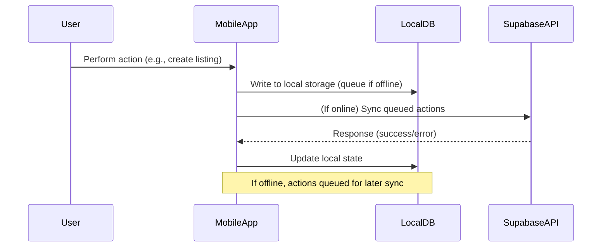

# AgriConnect Architecture Overview

## 1. System Context

AgriConnect is a mobile-first, offline-capable platform for small/marginal Indian farmers, buyers, and transport providers. The system uses a client-server model with a React Native app and a Supabase backend (PostgreSQL, Auth, Storage, Functions).

**Key Principles:**
- Offline-first, resilient to poor connectivity
- Secure Google OAuth authentication
- Modular, extensible, and multilingual
- Accessible and simple UI

---

## 2. High-Level Architecture Diagram

```mermaid
flowchart TD
  subgraph Mobile App (React Native)
    UI[Accessible Multilingual UI]
    LocalDB[Local Encrypted Storage<br/>(SQLite/AsyncStorage)]
    Sync[Sync Engine]
    Auth[Google OAuth]
    APIClient[API Client]
  end

  subgraph Supabase Backend
    AuthSvc[Auth Service]
    RESTAPI[REST API]
    DB[(PostgreSQL DB)]
    Storage[File Storage]
    Functions[Edge Functions]
  end

  UI -->|User Actions| LocalDB
  UI -->|User Actions| APIClient
  LocalDB <--> Sync
  Sync <--> APIClient
  APIClient <--> RESTAPI
  Auth -->|Google Token| AuthSvc
  AuthSvc <--> RESTAPI
  RESTAPI <--> DB
  RESTAPI <--> Storage
  RESTAPI <--> Functions
```

---

## 3. Component Diagram

```mermaid
flowchart LR
  subgraph Mobile App
    A1[Auth Module]
    A2[Marketplace Module]
    A3[Market Price Module]
    A4[Crop Advisory Module]
    A5[Post-Harvest Module]
    A6[Transport Module]
    A7[Offline Sync Module]
    A8[Localization & Accessibility Module]
    A9[UI Shell]
    A10[Local Storage]
  end

  subgraph Backend (Supabase)
    B1[Auth Service]
    B2[API Gateway]
    B3[Database]
    B4[Storage]
    B5[Functions]
  end

  A1 <--> B1
  A2 <--> B2
  A3 <--> B2
  A4 <--> B2
  A5 <--> B2
  A6 <--> B2
  A7 <--> B2
  A8 -.-> B2
  A9 --> A1
  A9 --> A2
  A9 --> A3
  A9 --> A4
  A9 --> A5
  A9 --> A6
  A9 --> A7
  A9 --> A8
  A2 <--> A10
  A3 <--> A10
  A4 <--> A10
  A5 <--> A10
  A6 <--> A10
  A7 <--> A10
```

---

## 4. Data Flow Diagram (Offline-First)



---

## 5. Technology Stack

- **Mobile:** React Native, Expo, SQLite/AsyncStorage, i18next, React Navigation, Redux/Context
- **Backend:** Supabase (PostgreSQL, Auth, Storage, Edge Functions), RESTful API
- **Security:** Google OAuth, HTTPS, JWT, encrypted local storage
- **Localization:** i18next, Unicode fonts, RTL support
- **Accessibility:** React Native Accessibility API, WCAG 2.1 AA

---

## 6. Security Architecture

- All authentication via Google OAuth (no passwords stored)
- JWT tokens for API access; refresh tokens securely managed
- All API traffic over HTTPS
- Input validation and sanitization on all endpoints
- Data encrypted at rest (Supabase/PostgreSQL) and in transit
- Rate limiting, abuse detection, and audit logging on backend
- No secrets or sensitive data in client code

---

## 7. Offline Functionality

- Core data (listings, advisory, guidance) cached locally
- All user actions (create, update, delete) queued offline
- Sync engine resolves conflicts and merges on reconnection
- Visual indicators for sync status and errors
- Graceful handling of partial sync, retries, and failures

---

## 8. Scalability Considerations

- Supabase/PostgreSQL horizontally scalable for 10,000+ users
- Modular backend for easy addition of new features/languages
- Efficient data sync and delta updates to minimize bandwidth
- CDN for static assets (images, advisory content)
- Monitoring, analytics, and automated backups

---

## 9. Extensibility & Maintainability

- Clear module boundaries (see diagrams)
- API contracts documented and versioned
- Automated tests for critical paths
- Comprehensive developer documentation

---

## 10. Glossary

- **Marketplace Module:** List/browse produce
- **Market Price Module:** View real-time prices
- **Advisory Module:** Crop health tips
- **Post-Harvest Module:** Storage/handling advice
- **Transport Module:** Request/offer transport
- **Offline Sync Module:** Local cache & sync
- **Localization Module:** Multilingual UI/content

---

## 11. Legend

- Solid arrows: direct data/API flow
- Dashed arrows: indirect or optional flow
- Double arrows: bidirectional sync

---

## 12. Rationale

- **Offline-first**: Empowers users with poor connectivity
- **Supabase**: Rapid, secure backend with minimal ops
- **React Native**: Cross-platform, accessible UI
- **Modularity**: Supports future features and languages
- **Security**: Protects user data and privacy